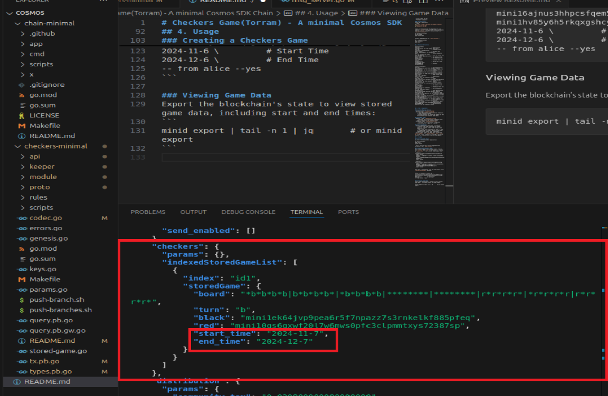

# Checkers Game(Torram) - A minimal Cosmos SDK Chain

### Project Overview
 This project implements a decentralized checkers game(Torram) using the Cosmos SDK v0.50. The game allows players to initiate, manage, and track checkers games on a blockchain network. Built upon the Cosmos SDK native checkers tutorial, this project extends the standard checkers module by adding custom features, such as enhanced game tracking and additional data storage, providing a more robust and informative gaming experience.

## 1. Getting Started

Prerequisites:
* Go : v1.21.1
* Cosmos SDK: v0.50.1
* Protobuf compiler

#### Installation:
Clone the repository:
```bash
git clone https://github.com/happy-creater/checkers-torram.git
cd checkers-torram
```

Clean up and organize the dependencies && compile `.proto` files into Go code, generates data structures and gRPC service stubs in `checkers-minimal`:
```
cd checkers-minimal
go mod tidy
make proto-gen
```

Install dependencies in `chain-minimal`:
```
cd ../chain-minimal
make install
```
Notes: Pleas make sure `Go` path is correct. You can fix easily. (ex: `export PATH=$PATH:$HOME/go/bin` on ubuntu22.04.1)

## 2.Project Structure
```
chain-minimal/
├── app/                   # Application configuration for the Cosmos SDK chain
├── cmd/                   # Command-line interface configuration
├── scripts/               # Scripts for setup, deployment, or automation
├── x/                     # Custom modules for the Cosmos SDK chain
├── .gitignore             # List of files and directories ignored by Git
├── go.mod                 # Go module file
├── go.sum                 # Go dependencies checksum file
├── LICENSE                # License for the project
├── Makefile               # Build and task automation file
├── README.md              # Project documentation

checkers-minimal/
├── api/                   # API definitions for interacting with the checkers module
├── keeper/                # Keeper logic for managing data in the checkers module
├── module/                # Module-related configurations and initializations
├── proto/                 # Protocol Buffer definitions for gRPC and message structures
├── rules/                 # Game rules and logic for checkers
├── scripts/               # Additional scripts for the checkers module
├── codec.go               # Codec registration for message encoding and decoding
├── errors.go              # Custom error definitions for the checkers module
├── genesis.go             # Genesis state configuration for initializing the checkers module
├── go.mod                 # Go module file for checkers
├── go.sum                 # Checksum file for dependencies in checkers
├── keys.go                # Key management for the checkers module
├── Makefile               # Task definitions for building and testing checkers module
├── params.go              # Parameters and configurations specific to the checkers module
├── query.pb.go            # Generated Go code for query protobuf definitions
├── query.pb.gw.go         # Generated Go code for gRPC gateway of queries
├── stored-game.go         # Struct and logic for storing game data in checkers module
├── tx.pb.go               # Generated Go code for transaction protobuf definitions
├── types.pb.go            # Additional data types generated from protobuf definitions
└── README.md              # Documentation specific to the checkers module

```

## 3. Key Components

### Custom Message Service
* Service Name: `CheckersTorram`
* RPC Method: `CheckersCreateGm`
    - This RPC handles game creation requests in the checkers module.
    - Allows players to start new games on the blockchain with relevant game data.

### Message Types
* Request Type: `ReqCheckersTorram`
    - Defines the structure of requests sent when creating a new checkers game.
* Response Type: `ResCheckersTorram`
    - Defines the structure of responses returned after a game is created.

### Enhanced Keeper
* Stores additional game data, including:
    - Start Time: The timestamp for when a game is created. (Here used string type temporarily)
    - End Time: The timestamp for when a game is completed or ended. (Used string type temeporarily rather than timestamp)
* Allows easy export of game data using the `minid export` or `minid export | tail -n 1 | jq`(clean mode) command, providing a detailed history of transactions, queries and games.

## 4. Usage

### Starting the chain
To start the blockchain application:
```
cd chain-minimal
make init
minid start
```
* Note: Ensure that install dependencies correctly (ex: `make install`)

### Creating a Checkers Game
Now create a game from another shell. First list `alice` and `bob`'s addresses as created by `make init`. 
```
minid keys list --keyring-backend test
```
This returns something like: 
```
- address: mini16ajnus3hhpcsfqem55m5awf3mfwfvhpp36rc7d
  name: alice
  pubkey: '{"@type":"/cosmos.crypto.secp256k1.PubKey","key":"A0gUNtXpBqggTdnVICr04GHqIQOa3ZEpjAhn50889AQX"}'
  type: local

- address: mini1hv85y6h5rkqxgshcyzpn2zralmmcgnqwsjn3qg
  name: bob
  pubkey: '{"@type":"/cosmos.crypto.secp256k1.PubKey","key":"ArXLlxUs2gEw8+clqPp6YoVNmy36PrJ7aYbV+W8GrcnQ"}'
  type: local
```

With this information, you can send your first `CheckersCreateGm` message:

```
minid tx checkers create id1 \
mini16ajnus3hhpcsfqem55m5awf3mfwfvhpp36rc7d \
mini1hv85y6h5rkqxgshcyzpn2zralmmcgnqwsjn3qg \
2024-11-7 \         # Start Time
2024-12-7 \         # End Time    
-- from alice --yes
```

### Viewing Game Data
Export the blockchain's state to view stored game data, including start and end times:
```
minid export | tail -n 1 | jq       # or minid export
```
This should return something with:


### Contributing
Contributions are welcome! Please open an issue or submit a pull request for suggestions and improvements